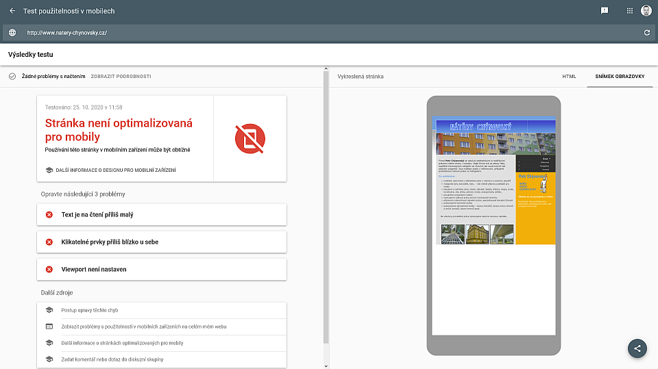
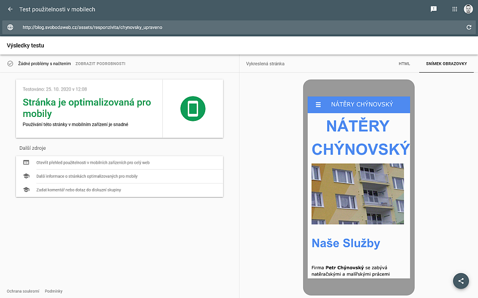

---
Responzivita webových stránek'
media_order: 'natery_original_test_responzivity.png,natery_original_test_rychlosti.png,natery_upraveno_test_responzivity.png,natery_upraveno_test_rychlosti.png
---

## Co je responzivita?
Pojem responzivita vychází ze slova response (odpověď, reakce). Je to schopnost přizpůsobit se a nejednat neustále jedním způsobem.
### Proč je důležité, aby webové stránky byly responzivní?
Protože na ně uživatel může nahlížet z širokoúhlé televize nebo velkého monitoru stejně tak jako z mobilu drženého na výšku.
**Pokud vaše stránky nejsou responzivní, odrazujete tím uživatele**, pro jejichž zařízení není web nastaven. Budou mít problémy se čtením obsahu a ovládání webu tlačítky atd.
 
**Ale především budete mít horší výsledky na vyhledávačích** (Google atd.), protože nesprávně nastavené weby mají postih (snížené skóre). Potenciální zákazníci se tedy mnohem pravděpodobněji dostanou na web vaší konkurence.
 
Nedostatečné nastavení se může projevit následovně:
* Obrázky jsou příliš velké a vybíhají mimo obrazovku
* Obsah je částečně zakryt, nedá se kliknout na důležité tlačítko
* Text je nečitelný
* Načítají se zbytečně velké obrázky a tím se zpomaluje chod stránky
* Není možné kliknout na mobilu na správné tlačítko, protože jsou stěsnané k sobě

**Takto např. vypadá náhled nedostatečně nastaveného webu:**
 
**Výsledek testu jasně ukazuje neúspěšný výsledek testu responzivity.**

**Zde je výsledek z testu rychlosti načtení:**
 
**83% a 0.8s. Ohodnoceno indexem B. Není to špatné, ale mohlo by to být lepší.**

 
 
Web v ukázce můžete [vidět zde](http://www.natery-chynovsky.cz/)

Základní responzitiva by měla zahrnovat optimalizaci zobrazení stránek podle šířky obrazovky zařízení uživatele. A nastavit dobré zobrazení a čitelnost alespoň pro 3 základní typy zařízení - malé (mobilní telefon), střední (tablet, notebook) a velké (kancelářský monitor).

**Po úpravách web bez problémů v testu responzitivity uspěl:**

 
 
**Test rychlosti také dopadl lépe:**
 
**94%, index hodnocení A, rychlost načtení 0.4s. Velmi dobrý výsledek.**

Upravený web s modernějším responzivním designem můžete [vidět zde](http://blog.svobodaweb.cz/assets/responzivita/chynovsky_upraveno/index.html)