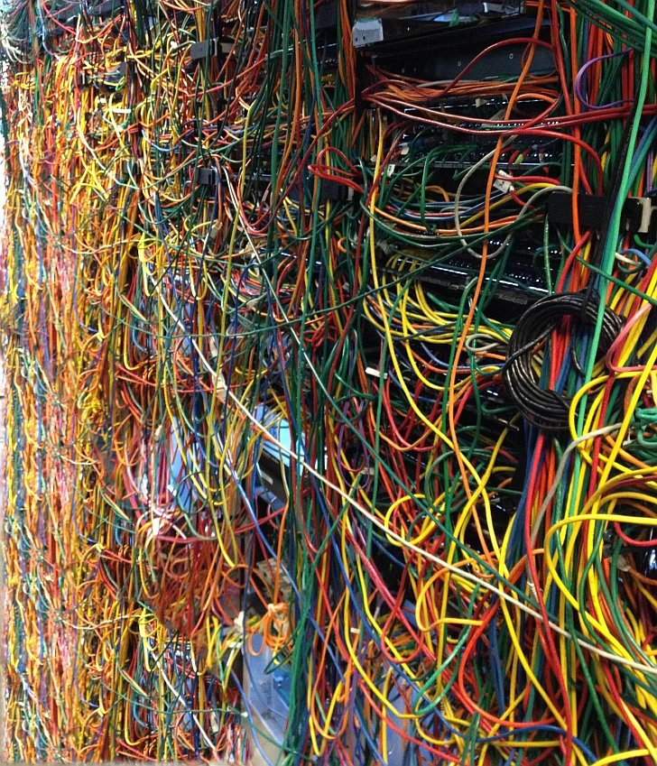

## Nevhodné vzory a řešení v programování'
media_order: bad-wiring.jpg

Stejně jako existují nějaké vzory, které programátorovi pomáhají posunout jeho kód na vyšší úroveň existují i tzv. anti vzory. Znaky problematické praktiky, která ze zkušenosti působí více problémů než užitku. Podíváme se na některé z nich.
## Špagety
Kód který je nesrozumitelný, nečitelný a nemá žádnou strukturu, žádné uspořádání. Viděli jste někdy alespoň na obrázku neodbornou elektro instalaci? Možná vám to připomene nepořádek v pokoji studentů na koleji či něco podobného, co jste kdysi vyklízeli z garáže po letech. Nechce se vám do toho, ale čím dříve se tím proberete, rozmotáte všechna klubka, tím méně dalšího chaosu se vám přestane nabalovat.

## Zlaté kladivo
Možná je to z lenosti nebo podohlnosti, ale může se vám stát, že přestanete kreativně přemýšlet a začnete používat jedno řešení na každý problém. Typickou ukázkou může být jQuery. Je to užitečná knihovna, která má své místo. Ale líný programátor, který ji použije na každý byť sebemenší projekt, kde chce jen zapojit efekt na klikací tlačítko svou leností nutí uživatele na mobilních telefonech stahovat desítky nebo i stovky kB dat, které nevyužijí.
## Táhnutí kotvy za lodí
Ponechávání starého kódu ve zdrojovém kódu, namísto jeho přesunutí do archivu repozitoře. Tento anti vzor často vidíme i na lidech v běžném životě. Koupím si tohle, protože to možná někdy budu potřebovat. Teď to sice nepotřebuji a nevím jistě, jestli kdy budu, ale teď je to ve slevě a tak jsou to potenciálně ušetřené peníze. Ale zároveň jsou to také potenciálně vyhozené peníze. Taky jsem na svůj první výlet s batohem na zádech nesl spoustu věcí navíc, které jsem pak nepoužil. V jednoduchosti je síla.
## Hluchý kód
Kód, který je ve skriptu přítomen, ale autor už ve firmě nepracuje a ostatní tomu nerozumí dost na to, aby si troufli ho odstranit. A tak se na něj kupí nové dodatky. Místo toho, aby se udělal jasný a čistý řez a odstranilo se vše, co není potřeba a aplikace měla jen to, co potřebuje se přenáší minulost stále dál a dál. Protože chytrý údržbář vám tvrdí, že co není rozbité, to neopravuj. Do určité míry má pravdu. Ale až se to jednou rozbije a nebude nablízku nikdo, kdo rozumí tomu, jak to vlastně funguje a autor sám už je někde za sedmero horami, zůstanete na to sami a pod časovým stresem.
## Švýcarák
Jedna classa, která umí vše, volá se všude a dělá každou činnost, která je v chodu aplikace potřeba. Když se ale objeví sebemenší problém, spadne ne jen část, která řeší problematický úsek, spadne úplně vše. Je to velmi nebezpečný vzor. Je to jako mít klíče od bytu, auta a všechny doklady, peníze a platební karty s PINem napsaným fixou na druhé straně spolu s telefonem v ledvince na dovolené. Pokud vám ji někdo na pláži ukradne, rázem se z vás stane v podstatě bezdomovec. Nemáte žádnou zálohu a řešení je velmi svízelné.
## Přizdisráč / Prostředník
Prostředník existuje jen protože ostatní třídy, jejichž objekty spolu komunikují nejsou dost dobře napsané na to, aby spolu mohli komunikovat napřímo. Je zde tedy servírka, která jen běhá mezi kuchyní a platebním pultem. Mnoho firem si tohoto fenoménu všimlo. Že management jde udělat mnohem jednodušeji. Všimli jste si, že v nákupních obchodech už není 10 pokladních, ale jen 4? A že jsou nainstalovány nové samoobslužné poklady, na které jen pracovník obsluhy dohlíží a řeší pouze vzniklé problémy? Existují i bezobslušné benzínky, kde sice není koš a kýbl s vodou na umytí oken, ale benzín je tam o 2 Kč levnější. Právě protože se ušetří za obsluhu.
