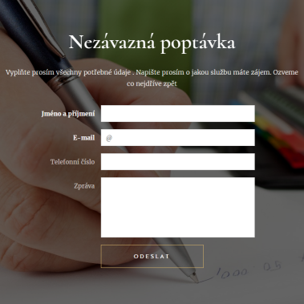
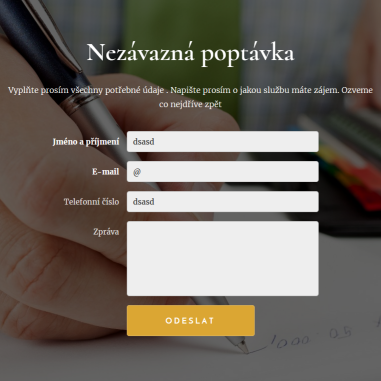
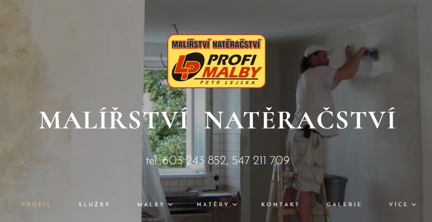
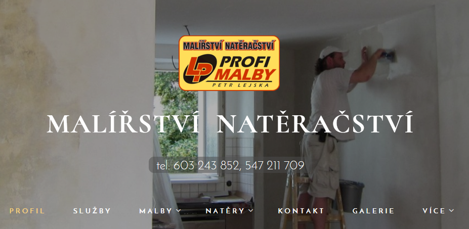
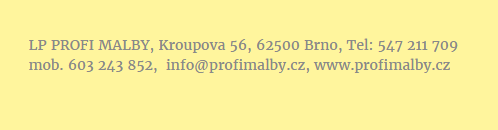
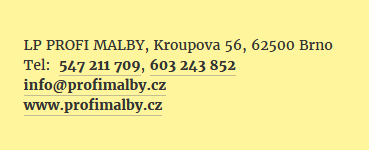
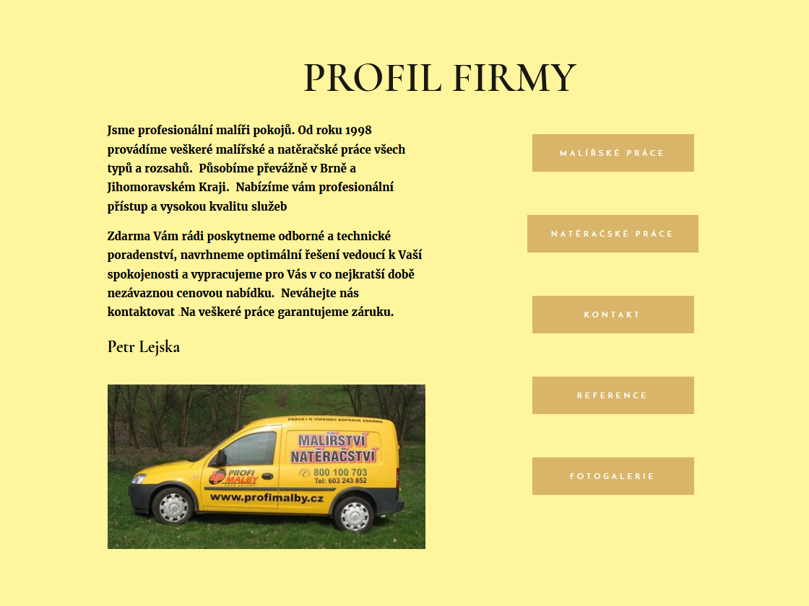
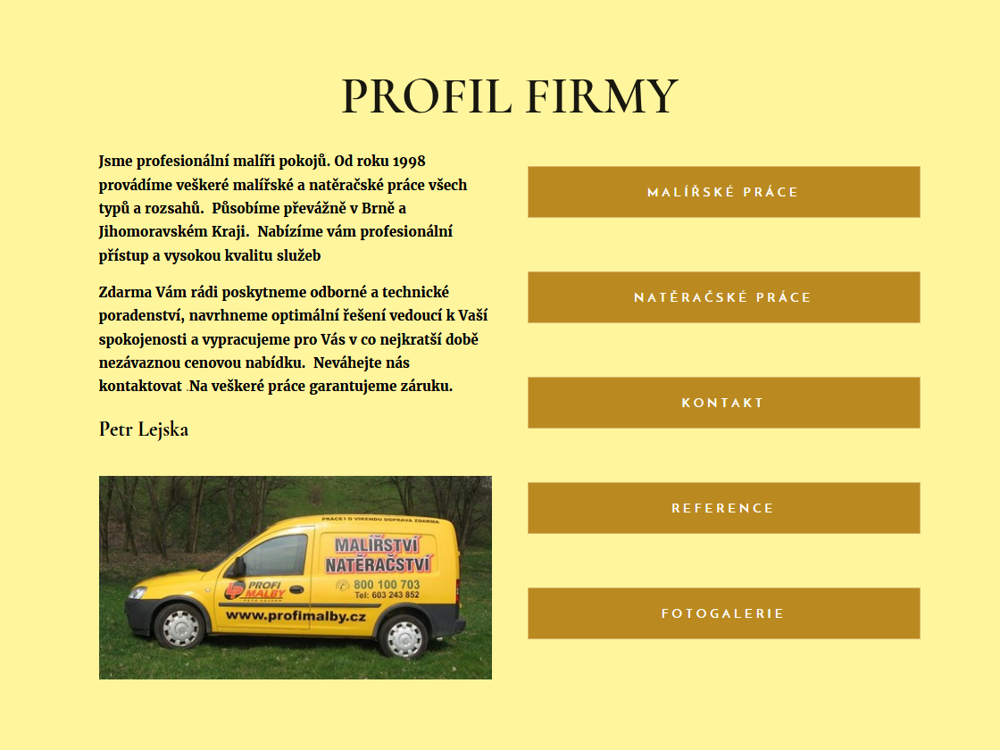
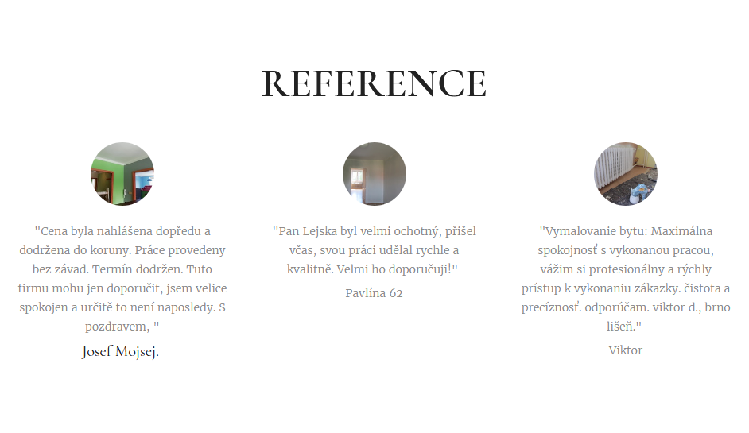
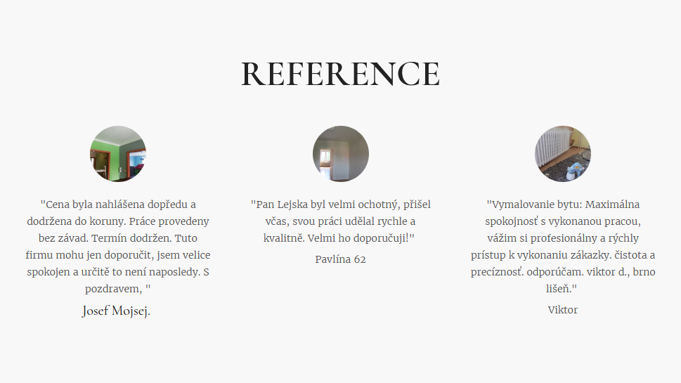

## Proč se vyplatí investovat do úpravy šablony na míru?
Nejlépe fungují produkty, které jsou dělané na míru. Oblek, který máte šitý přímo pro sebe padne jako ulitý. Při nákupu konfekce jste nuceni občas udělat tu a tam kompromis. Ale to, že vám krejčí nešije celý oblek neznamená, že vám nemůže pomoci s pár detaily.
 
**Použitím webové šablony razantně klesají náklady na výrobu webových stránek. To je fakt.**
 
Její tvůrce ale nemůže vyladit to, co tam přidáte a vložíte vy sami. A po naplnění šablony reálným obsahem je vhodné vše znovu projít a udělat případné úpravy. Stačí několik málo úpravy a uživatelův dojem bude mnohem lepší.
 
### Na co je potřeba si dát u šablon pozor?
* Aby výsledný kontrast nebyl příliš nízký ani vysoký
 
Tím zaručíme uživatelům optimální čitelnost textů a viditelnost ovládacích prvků (tlačítka, zaškrtávátka, prvky kontaktního formuláře)
* Vhodné umístění klíčových informací
* Globální styly pro písmo a barvy
* Celkové sladění tématu šablony s oborem, kterému se web věnuje

A zde pár ukázek, jak drobné úpravy zvyšují čitelnost nebo viditelnost a tím i celkovou použitelnost:

**Zvýraznění ovládacího prvku formuláře, zaoblení hran:**

**Zvýraznění navigačních odkazů a zlepšení čitelnosti tel. kontaktu**

**Zlepšení přehlednosti kontaktních údajů v patičce**

**Zlepšení čitelnosti textu odkazů**

**Zmírnění jasu pozadí a použití tmavší barvy textu referencí**

